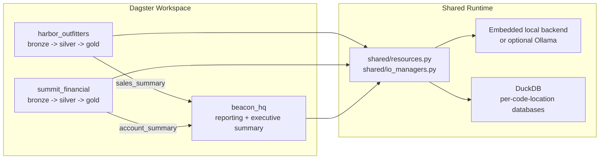

# Dagster Multi-Tenant Example

This example project is a runnable Dagster demo that shows how to:

- split one project into multiple Dagster code locations
- keep tenant pipelines isolated while coordinating them from Dagster
- treat LLM work as data engineering and context engineering, not just prompt calls
- run different model/runtime combinations per code location
- run end to end with a bundled local LLM backend and optionally swap to Ollama

## Getting Started

Bootstrap your own Dagster project with this example:

```bash
dagster project from-example --name my-dagster-project --example project_multi_tenant
```

To work with the copy that lives in this repository directly:

```bash
cd dagster/examples/project_multi_tenant
```

Then continue with the local setup below.

The example uses three business-facing code locations:

- `harbor_outfitters`: retail catalog enrichment
- `summit_financial`: transaction risk scoring
- `beacon_hq`: executive reporting built from upstream business outputs

## Architecture



## What The Demo Shows

- `harbor_outfitters` builds catalog context from product, brand, and taxonomy data before generating enriched product copy.
- `summit_financial` builds investigation context from transactions, accounts, and rules before generating transaction rationales.
- `beacon_hq` depends on upstream business outputs and turns them into a short executive briefing.

The local setup is intentionally opinionated:

- one root development environment
- one bundled deterministic LLM backend that works out of the box
- one optional Ollama backend if you want live model calls
- optional copied Python environments per code location for runtime marker demos

## Repository Layout

```text
harbor_outfitters/     Retail assets, jobs, and schedules
summit_financial/      Financial assets, jobs, and schedules
beacon_hq/             Reporting assets, jobs, and sensors
shared/                Shared LLM resource, IO manager, and metadata helpers
scripts/               Local setup scripts for models and per-location envs
vendor/                Tiny runtime marker packages installed per code location
tests/                 End-to-end unit tests with fake LLM resources
workspace.yaml         Multi-code-location Dagster workspace
dagster_cloud.yaml     Dagster+ style code location config
```

## Local Stack

The default backend is fully in-project:

- `LLM_BACKEND=embedded` uses deterministic local responses and does not require Docker or model downloads.

If you switch to Ollama, each code location uses its own default model:

- `harbor_outfitters`: `qwen2.5:0.5b`
- `summit_financial`: `qwen2.5:1.5b`
- `beacon_hq`: `qwen2.5:0.5b`

Business-facing environment variables:

- `LLM_BACKEND`
- `HARBOR_OUTFITTERS_MODEL`
- `SUMMIT_FINANCIAL_MODEL`
- `BEACON_HQ_MODEL`

The project also includes optional runtime marker packages:

- `harbor_outfitters`: `catalog_coach_runtime==1.4.0`
- `summit_financial`: `risk_reviewer_runtime==2.2.0`
- `beacon_hq`: `briefing_writer_runtime==0.9.0`

Those markers are bundled under `vendor/` and can be installed into isolated code-location environments if you want to demonstrate per-location runtime differences.

Assets are persisted to per-code-location DuckDB databases under `data/`.

## Quickstart

Copy the local environment file:

```bash
cp .env.example .env
```

Create the root development environment and install the project with its vendor runtime
marker packages:

```bash
python -m venv .venv
source .venv/bin/activate
pip install -e ".[dev]"
pip install -e vendor/catalog_coach_runtime \
            -e vendor/risk_reviewer_runtime \
            -e vendor/briefing_writer_runtime
```

Load the environment and start Dagster:

```bash
set -a
source .env
set +a
export DAGSTER_HOME=$(pwd)/.dagster_home
mkdir -p "$DAGSTER_HOME"
dagster dev -w workspace.yaml
```

Then open `http://127.0.0.1:3000`. The webserver and daemon (schedules, sensors,
backfills) both start automatically.

> **Note:** `dagster dev` is the standard way to start Dagster locally. If you have
> `dagster-dg-cli` installed (included in the `[dev]` extras), you can also use
> `dg dev -w workspace.yaml`.

## Optional Ollama Backend

If you want live model calls instead of the bundled local backend:

```bash
source .venv/bin/activate
export LLM_BACKEND=ollama
docker compose up -d ollama
./scripts/pull_ollama_models.sh
dagster dev -w workspace.yaml
```

## Optional Isolated Code-Location Environments

If you want each code location to carry its own runtime marker package in a copied environment:

```bash
source .venv/bin/activate
./scripts/setup_code_location_envs.sh
```

## Validation

Run the local checks with:

```bash
source .venv/bin/activate
set -a
source .env
set +a
export DAGSTER_HOME=$(pwd)/.dagster_home
mkdir -p "$DAGSTER_HOME"
ruff check .
pytest -q -o cache_dir=/tmp/pytest-cache
dagster definitions validate -w workspace.yaml
```

## Demo Flow

With `dagster dev` running, open the Dagster UI at `http://127.0.0.1:3000` and
materialize assets through the UI, or launch the pipeline jobs in order from
the command line using the GraphQL API or the Jobs page.

The recommended order is:

1. **Harbor Outfitters + Summit Financial** (can run in parallel):
   - `harbor_catalog_publish_job` materializes all Harbor assets (bronze through gold)
   - `summit_risk_scoring_job` materializes all Summit assets (bronze through gold)
2. **Beacon HQ** (depends on upstream outputs from step 1):
   - `beacon_reporting_inputs_job` builds `consolidated_revenue`, `risk_overview`, and `briefing_highlights`
   - `beacon_executive_briefing_job` produces the `executive_summary` and `executive_llm_audit_log`

If you enable Ollama, avoid launching the LLM-heavy runs in parallel unless you increase machine capacity.

## Jobs And Automation

The repo includes pipeline-shaped jobs for each business unit:

- `harbor_catalog_publish_job`
- `summit_risk_scoring_job`
- `beacon_executive_briefing_job`

It also includes simple cross-location orchestration:

- `harbor_daily_refresh_schedule`
- `summit_daily_refresh_schedule`
- `beacon_after_upstream_success_sensor`

The key point is that lineage crosses code locations, but execution stays per code location. Beacon reacts to Harbor and Summit outputs instead of collapsing everything into one monolithic job.

## Notes

- Runtime DataFrame metadata includes `row_count` and `top_5_rows` on asset materializations.
- Tests use fake LLM resources from `tests/fakes.py`; the default project runtime uses the bundled local backend in `shared/resources.py`.
- Ollama remains available as an opt-in backend for a live local-model demo.
