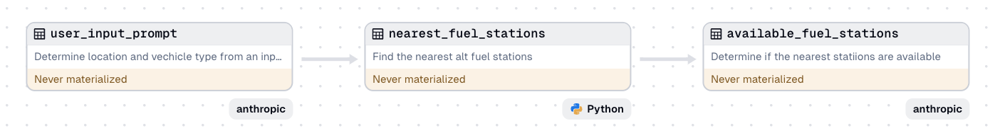

## Dagster × Anthropic Prompt Engineering Demo

Use prompt engineering to find nearby alternative fuel stations.

In this example project, we show how you can write a pipeline that leverages prompt
engineering to better craft answers that can be relied on for engineering
across assets

### Example Asset Lineage



## Getting started

Install the project dependencies:

```sh
pip install -e ".[dev]"
```

Run Dagster:

```sh
dagster dev
```

Open http://localhost:3000 in your browser.

## References

Dagster

- [Dagster Docs](https://docs.dagster.io/)
- [Dagster Anthropic integration](https://docs.dagster.io/integrations/anthropic)

Anthropic

- [Anthropic Prompt Engineering](https://docs.anthropic.com/en/docs/build-with-claude/prompt-engineering/overview)
