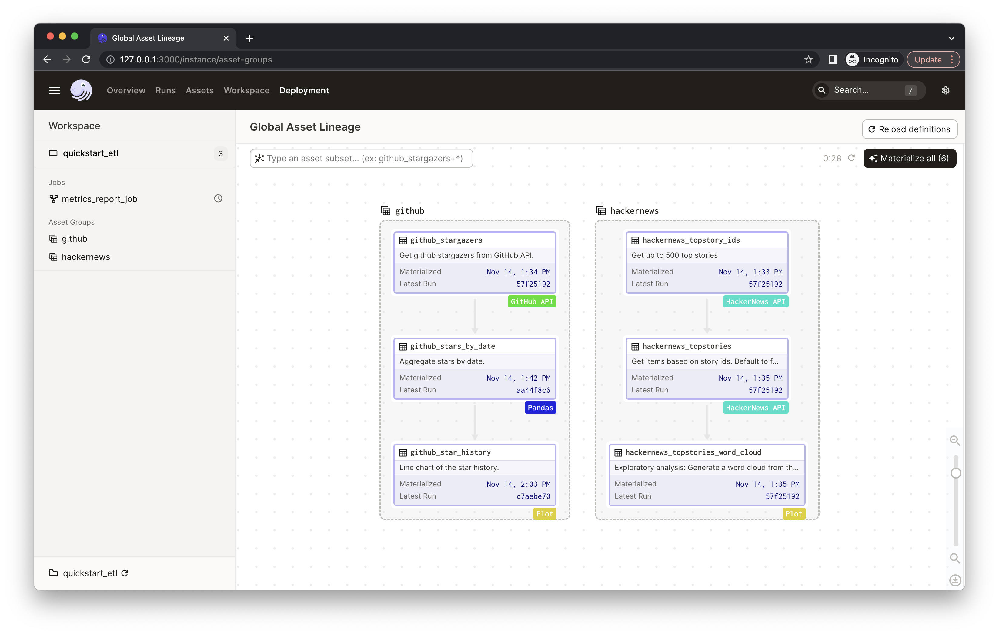
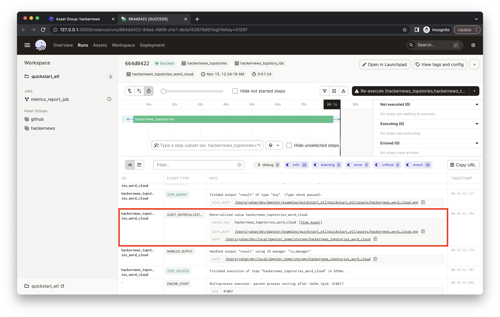
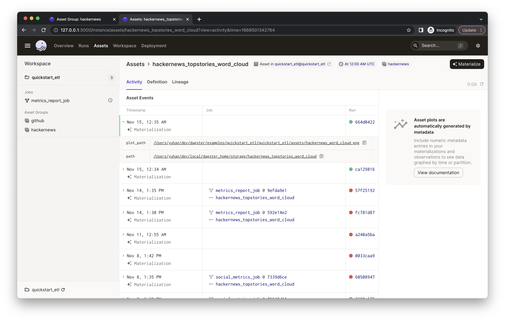
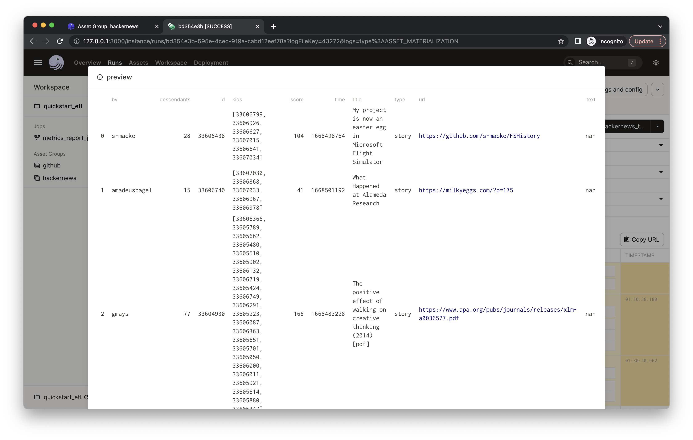
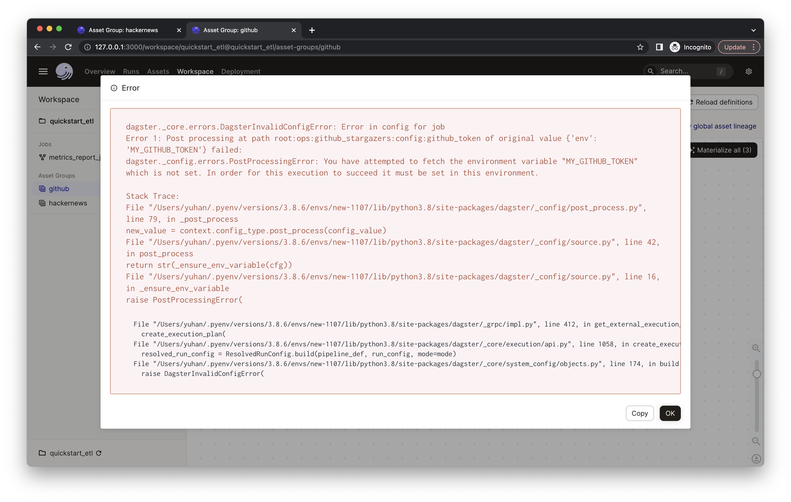
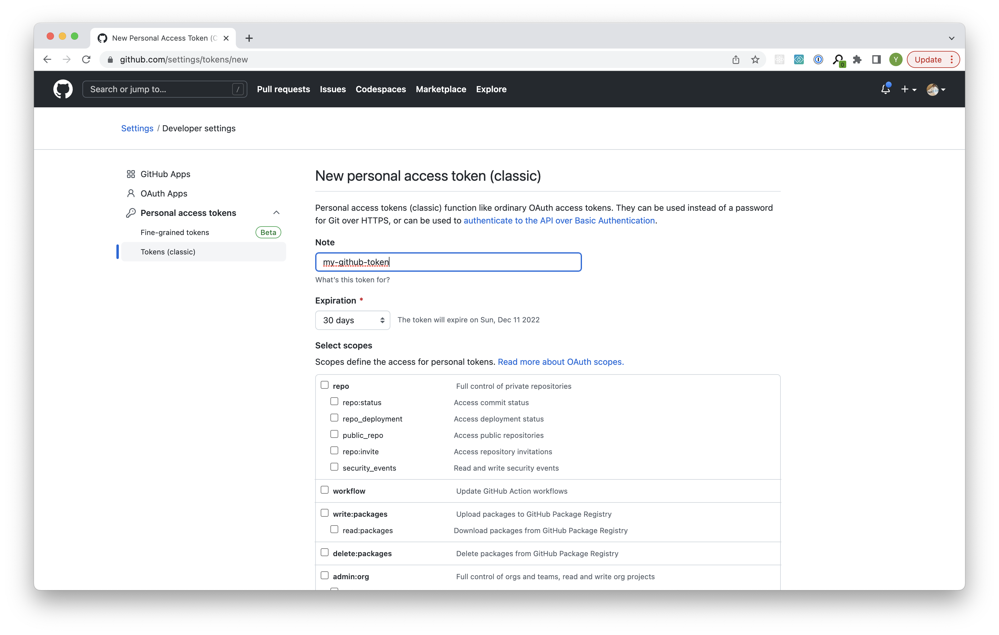

# Dagster starter kit

This example is a starter kit for building a daily ETL pipeline. At a high level, this project shows how to ingest data from external sources, explore and transform the data, and materialize outputs that help visualize the data.

*New to Dagster? Learn what Dagster is [in Concepts](https://docs.dagster.io/concepts) or [in the hands-on Tutorials](https://docs.dagster.io/tutorial).*

This guide covers:
- [Introduction](#introduction)
- [Getting started](#getting-started)
- [Step 1: Materializing assets](#step-1-materializing-assets)
- [Step 2: Configuring assets](#step-2-Configuring-assets)
- [Step 3: Scheduling a daily job](#step-3-scheduling-a-daily-job)
- [Learning more](#learning-more)


## Introduction

This starter includes:
- Basics of creating, connecting, and testing [assets](https://docs.dagster.io/concepts/assets/software-defined-assets) in Dagster.
- Convenient ways to organize and monitor assets, e.g. [grouping assets](https://docs.dagster.io/concepts/assets/software-defined-assets#grouping-assets), [recording asset metadata](https://docs.dagster.io/concepts/assets/software-defined-assets#recording-materialization-metadata), etc.
- Configurations that [use environment variables](https://docs.dagster.io/guides/dagster/using-environment-variables-and-secrets) to provide secrets so that sensitive information won't be visible in code or in the UI.
- A [schedule](https://docs.dagster.io/concepts/partitions-schedules-sensors/schedules) defined to run a job that generates assets daily.
- [Scaffolded project layout](https://docs.dagster.io/getting-started/create-new-project) that helps you to quickly get started with everything set up.


In this project, we're building an ETL pipeline that monitors the popularity of open-source software projects. Here is the Global Asset Lineage you'll find in the UI:

<p align="center">
    
</p>

This project:

- Fetches data from [HackerNews](https://github.com/HackerNews/API) and [GitHub](https://pygithub.readthedocs.io) APIs.
- Transforms and aggregates the collected data using [Pandas](http://pandas.pydata.org/pandas-docs/stable/).
- Creates visualizations for exploratory analysis (e.g. [word cloud](https://github.com/amueller/word_cloud) based on trending HackerNews stories) and reporting (e.g. line chart for GitHub star history).

## Getting started

### Option 1: Deploying it on Dagster Cloud

The easiest way to spin up your Dagster project is to use Dagster Cloud.

Check out the [Dagster Cloud Documentation](https://docs.dagster.io/dagster-cloud) to learn more.

<!-- <TODO: add a button to link to NUX template flow?> -->


### Option 2: Running it locally

Bootstrap your own Dagster project with this example:

```bash
dagster project from-example --name my-dagster-project --example quickstart_etl
```

First, install your Dagster repository as a Python package. By using the --editable flag, pip will install your repository in ["editable mode"](https://pip.pypa.io/en/latest/topics/local-project-installs/#editable-installs) so that as you develop, local code changes will automatically apply.

```bash
pip install -e ".[dev]"
```

Then, start the Dagit web server:

```bash
dagit
```

Open http://localhost:3000 with your browser to see the project.

You can start writing assets in `quickstart_etl/assets/`. The assets are automatically loaded into the Dagster repository as you define them.

<!-- ### Option 3: Running it in Gitpod
Open source friendly
<TODO: set up gitpod> -->

## Step 1: Materializing assets

With the starter project loaded in your browser, you'll see both jobs and assets listed in the left nav.

<p align="center">
    
</p>

Click on the `hackernews` asset group to view the HackerNews assets and their relationship.

This asset group ingests the current trending 500 HackerNews stories and then plots a word cloud out of the collected stories to visualize the popular topics on HackerNews. You'll see three assets with different tags:

- `hackernews_topstory_ids` fetches a list of top story ids from a HackerNews endpoint.
- `hackernews_topstories` takes the list of ids and pulls the story details from HackerNews based on the ids.
- `hackernews_stories_word_cloud` explores the dataset by visualizing the word cloud of trending story titles.


Dagster visualizes upstream and downstream dependencies vertically. Nodes below other nodes connected by arrows implies a dependency relationship. So we can tell from the UI that the asset `hackernews_topstories` depends on `hackernews_topstory_ids` (i.e. `hackernews_topstories` takes `hackernews_topstory_ids`'s output as an input) and `hackernews_stories_word_cloud` depends on `hackernews_topstories`.

An asset is a software object that models a data asset, which can be a file in your filesystem, a table in a database, or a data report. All three assets are defined [in `quickstart_etl/assets/hackernews.py`](./quickstart_etl/assets/hackernews.py). Typically, you'll define assets by annotating ordinary Python functions with the [`@asset`](https://docs.dagster.io/concepts/assets/software-defined-assets#a-basic-software-defined-asset) decorator. This project comes with ways to better organize the assets:
- You'll find the assets are tagged with different kinds, such as `HackerNews API` and `Plot`. This is defined in code via the `compute_kind` argument to the `@asset` decorator. It can be any string value that represents the kind of computation that produces the asset and will be displayed in the UI as a badge on the asset -- It helps understand the data logic quickly from a bird's eye view.
- We've also assigned all three assets to group `hackernews`. This can be done through the `group_name` argument to the `@asset` decorator -- This helps keep your assets organized as your project grows. Learn about asset grouping [here](https://docs.dagster.io/concepts/assets/software-defined-assets#assigning-assets-to-groups).
- In the asset graph, the UI also shows the description of each asset. You can specify the description of an asset in the `description` argument to `@asset`. When the argument is not provided, and the decorated function has docstring, Dagster will use the docstring as the description. In this example, the UI is using the docstrings as the descriptions.

Now we've got a basic understanding of Dagster assets. Let's actually materialize the assets.

<p align="center">
    
</p>

Click `Materialize all`.


<p align="center">
    
</p>

You'll see an indicator pops up with the launched run ID. You can click "View" to monitor the run in real-time. This will open a new tab in your browser:

<p align="center">
    
</p>

The process will run for a bit. While it's running, you should see the real-time compute logs printed in the UI. *(It may take 1-2 minutes to fetch all top 500 stories from HackerNews in the `hackernews_topstories` step).*

When the run completes, you'll see a metadata called `plot_path` that's attached to an "ASSET_MATERIALIZATION" event. It should point to the path of the plot file `hackernews_word_cloud.png`.

<p align="center">
    
</p>


Now you've completed a Dagster run and it generated a word cloud of the top 500 HackerNews story titles in the given file path:

<p align="center">
    
</p>

<!-- TODO: test this in dagster cloud -->

The file path is specified in the `hackernews_topstories_word_cloud` asset [in `quickstart_etl/assets/hackernews.py`](./quickstart_etl/assets/hackernews.py). Dagster supports attaching arbitrary [metadata](https://docs.dagster.io/_apidocs/ops#dagster.MetadataValue) to asset materializations. This metadata will also be displayed on the "Activity" tab of the "Asset Details" page in the UI. From the compute logs of a run, You can click the "View Asset" to go to the "Asset Details" page. This metadata would be useful for monitoring and maintaining the asset as you iterate.

<p align="center">
    
</p>


Similarly, we've also recorded some metadata in the `hackernews_topstories` asset. You can filter the compute logs by typing the asset name (e.g. `hackernews_topstories`) or the event type (e.g. `type:ASSET_MATERIALIZATION`) in the "Log Filter" input box:

<p align="center">
    
</p>

Then, you can find the `hackernews_topstories` asset has two metadata entries: `num_records` and `preview`. Both are defined [in `quickstart_etl/assets/hackernews.py`](./quickstart_etl/assets/hackernews.py), in which we record the first five rows of the output Pandas DataFrame in the `preview` metadata entry as Markdown type -- This could help debug and keep your assets easily monitored. Click "Show Markdown", and you will see the preview of the output data frame:

<p align="center">
    
</p>

Note: You'll find a `path` metadata attached to every asset. This is because by default assets are materialized to pickle files on your local filesystem. In most projects, your assets will be materialized to a production system, and you can fully customize the I/O using [I/O managers](https://docs.dagster.io/concepts/io-management/io-managers).


## Step 2: Configuring assets

Now you've got your first couple of assets materialized. To dive in and understand the popularity of any given open-source project, let's add one more data source to the pipeline: GitHub.

Navigate to the `github` asset group and click `Materialize all`. When you try to materialize assets in this group, you will encounter the following error. This is because we need to add some secrets.
<p align="center">
    
</p>

### Generating GitHub Personal Access Token

To interact with GitHub APIs, you will need to generate a personal access token. Follow the ([ GitHub instructions](https://docs.github.com/en/authentication/keeping-your-account-and-data-secure/creating-a-personal-access-token#creating-a-personal-access-token-classic)) to generate a new token. In this example, we created a token called "my-github-token" (it can be any arbitrary name).

<p align="center">
    
</p>

Your token value should look like this:
<p align="center">
    
</p>

Make sure to copy your new personal access token now. You won't be able to see it again!

There are several ways to declare and access secrets in Dagster. Check out [Using environment variables and secrets](https://docs.dagster.io/guides/dagster/using-environment-variables-and-secrets) for more details.

In this example in [quickstart_etl/assets/github.py](./quickstart_etl/assets/github.py), we are using [`config_schema`](https://docs.dagster.io/_apidocs/config#dagster.ConfigSchema) to indicate the `github_stargazers` asset can accept a config parameter called `github_token`, and using [`StringSource`](https://docs.dagster.io/_apidocs/config#dagster.StringSource) to indicate that the `github_token` can either be a) an environment variable or b) provided directly in the configuration.

In this guide, we'll talk about the two ways that add the token as an environment variable:
- [Adding the token as an environment variable locally](#adding-the-token-as-an-environment-variable-locally)
- [Adding the token via Dagster Cloud's Environment Variable settings](#TODO)

You can read more about our recommendations on handling secrets [here](https://docs.dagster.io/guides/dagster/using-environment-variables-and-secrets#handling-secrets).

### Adding the token as an environment variable locally

If Dagit is still running in your browser, you can interrupt it in the terminal window with cntl/cmd+C.

1. Add the token to your environment: `export MY_GITHUB_TOKEN="ghp_*****"` inside either your `.bash_profile`, `.bashrc`, or `.zshrc`. *Important: You will need to `source` your bash profile (or restart the terminal) afterwards.
2. Verify you see your token: Open a new terminal and run `echo $MY_GITHUB_TOKEN`.
3. All set! Start `dagit` again and now you should be able to materialize all the `github` assets using your own GitHub token.

<!-- TODO
- windows
- 3rd party secrets manager -->

### Adding the token via Dagster Cloud's Environment Variable settings

<TODO: screenshots + explainers>

## Step 3: Scheduling a daily job

Finally, let's refresh our plots every day, so we can monitor the popular topics and the project's popularity over time. To do so, we can use [Schedules](https://docs.dagster.io/concepts/partitions-schedules-sensors/schedules#schedules).

We've defined a daily schedule in [quickstart_etl/repository.py](./quickstart_etl/repository.py) for all assets that are defined in the [quickstart_etl/assets/](./quickstart_etl/assets) sub-module.

<TODO>
So, now in the UI, click "metrics_report_job". you will find the job has a schedule  . Turn on the schedule.
<p align="center">
    
</p>

</TODO>
Congratulations 🎉 You now have a daily job running in production!

## Learning more

<TODO: links to other post NUX guides>

### Adding new Python dependencies

You can specify new Python dependencies in `setup.py`.

### (Optional) Unit testing

<details><summary>Expand to view</summary>

Tests are in the `quickstart_etl_tests` directory and you can run tests using `pytest`:

```bash
pytest quickstart_etl_tests
```

</details>


### (Optional) Schedules and sensors


<details><summary>Expand to view</summary>

If you want to enable Dagster [Schedules](https://docs.dagster.io/concepts/partitions-schedules-sensors/schedules) or [Sensors](https://docs.dagster.io/concepts/partitions-schedules-sensors/sensors) for your jobs, start the [Dagster Daemon](https://docs.dagster.io/deployment/dagster-daemon) process in the same folder as your `workspace.yaml` file, but in a different shell or terminal.

The `$DAGSTER_HOME` environment variable must be set to a directory for the daemon to work. Note: using directories within /tmp may cause issues. See [Dagster Instance default local behavior](https://docs.dagster.io/deployment/dagster-instance#default-local-behavior) for more details.

```bash
dagster-daemon run
```

Once your Dagster Daemon is running, you can start turning on schedules and sensors for your jobs. -->


</details>
