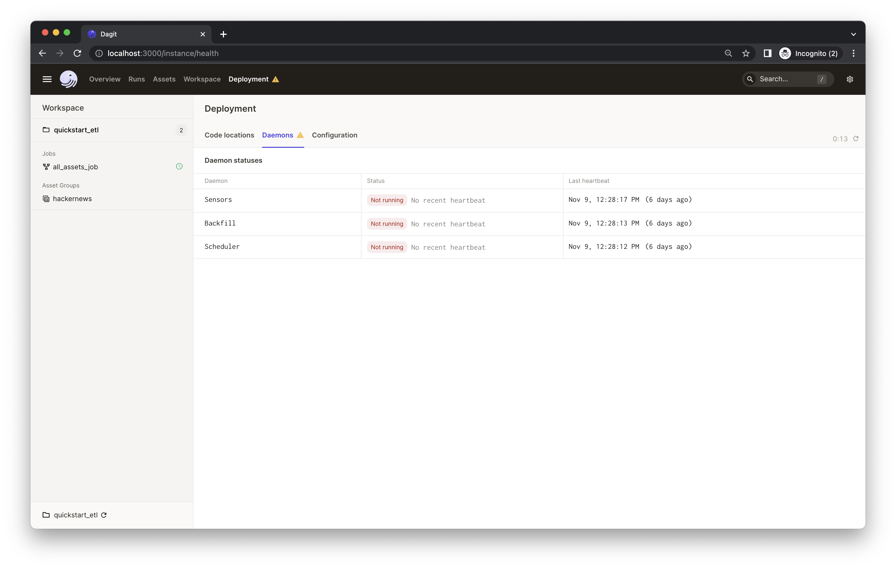
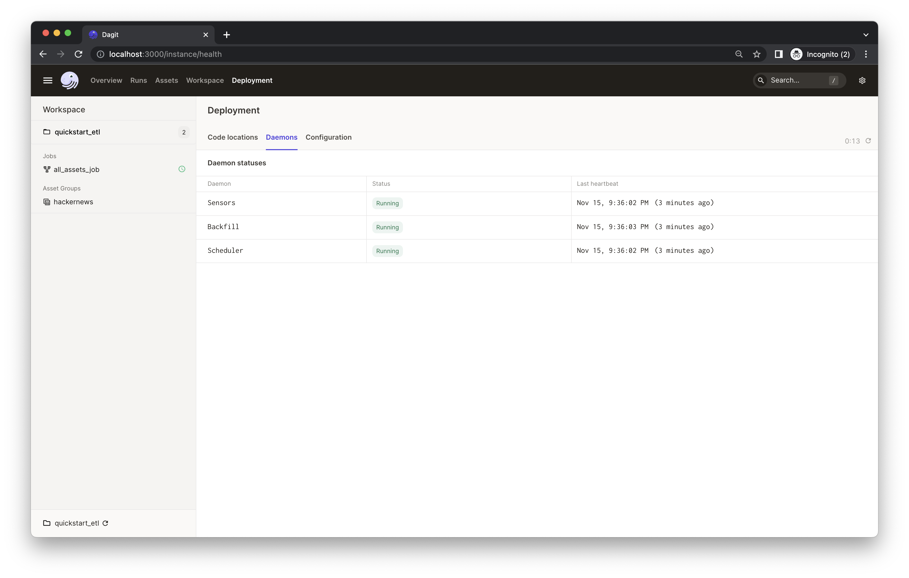

# Dagster starter kit

This example is a starter kit for building a daily ETL pipeline. At a high level, this project shows how to ingest data from external sources, explore and transform the data, and materialize outputs that help visualize the data.

*New to Dagster? Learn what Dagster is [in Concepts](https://docs.dagster.io/concepts) or [in the hands-on Tutorials](https://docs.dagster.io/tutorial).*

This guide covers:
- [Dagster starter kit](#dagster-starter-kit)
  - [Introduction](#introduction)
  - [Getting started](#getting-started)
    - [Option 1: Deploying it on Dagster Cloud](#option-1-deploying-it-on-dagster-cloud)
    - [Option 2: Running it locally](#option-2-running-it-locally)
  - [Step 1: Materializing assets](#step-1-materializing-assets)
  - [Step 2: Viewing and monitoring assets](#step-2-viewing-and-monitoring-assets)
  - [Step 3: Scheduling a daily job](#step-3-scheduling-a-daily-job)
    - [(Optional) Running daemon locally](#optional-running-daemon-locally)
  - [Learning more](#learning-more)
    - [Changing the code locally](#changing-the-code-locally)
    - [Using environment variables and secrets](#using-environment-variables-and-secrets)
    - [Adding new Python dependencies](#adding-new-python-dependencies)
    - [Testing](#testing)


## Introduction

This starter includes:
- Basics of creating, connecting, and testing [assets](https://docs.dagster.io/concepts/assets/software-defined-assets) in Dagster.
- Convenient ways to organize and monitor assets, e.g. [grouping assets](https://docs.dagster.io/concepts/assets/software-defined-assets#grouping-assets), [recording asset metadata](https://docs.dagster.io/concepts/assets/software-defined-assets#recording-materialization-metadata), etc.
- A [schedule](https://docs.dagster.io/concepts/partitions-schedules-sensors/schedules) defined to run a job that generates assets daily.
- [Scaffolded project layout](https://docs.dagster.io/getting-started/create-new-project) that helps you to quickly get started with everything set up.


In this project, we're building an analytical pipeline that explores popular topics on HackerNews.

<p align="center">
    
</p>

This project:

- Fetches data from [HackerNews](https://github.com/HackerNews/API) APIs.
- Transforms the collected data using [Pandas](http://pandas.pydata.org/pandas-docs/stable/).
- Creates a [word cloud](https://github.com/amueller/word_cloud) based on trending HackerNews stories to visualize popular topics on HackerNews.

## Getting started

### Option 1: Deploying it on Dagster Cloud

The easiest way to spin up your Dagster project is to use [Dagster Serverless](https://docs.dagster.io/dagster-cloud/deployment/serverless). It provides out-of-the-box CI/CD and native branching that make development and deployment easy.

Check out the [Dagster Cloud](https://dagster.io/cloud) to get started.

### Option 2: Running it locally

Bootstrap your own Dagster project with this example:

```bash
dagster project from-example --name my-dagster-project --example quickstart_etl
```

First, install your Dagster repository as a Python package. By using the --editable flag, pip will install your repository in ["editable mode"](https://pip.pypa.io/en/latest/topics/local-project-installs/#editable-installs) so that as you develop, local code changes will automatically apply. Check out [Dagster Installation](https://docs.dagster.io/getting-started/install) for more information.

```bash
pip install -e ".[dev]"
```

Then, start the Dagit web server:

```bash
dagit
```

Open http://localhost:3000 with your browser to see the project.

## Step 1: Materializing assets

With the starter project loaded in your browser, you'll see both jobs and assets listed in the left nav.

<p align="center">
    
</p>

Click on the `hackernews` asset group to view the HackerNews assets and their relationship.

This asset group ingests the current trending 500 HackerNews stories and then plots a word cloud out of the collected stories to visualize the popular topics on HackerNews. You'll see three assets with different tags:

- `hackernews_topstory_ids` fetches a list of top story ids from a HackerNews endpoint.
- `hackernews_topstories` takes the list of ids and pulls the story details from HackerNews based on the ids.
- `hackernews_stories_word_cloud` visualizes the trending topics in a word cloud.


Dagster visualizes upstream and downstream dependencies vertically. Nodes below other nodes connected by arrows implies a dependency relationship. So we can tell from the UI that the asset `hackernews_topstories` depends on `hackernews_topstory_ids` (i.e. `hackernews_topstories` takes `hackernews_topstory_ids`'s output as an input) and `hackernews_stories_word_cloud` depends on `hackernews_topstories`.

An asset is a software object that models a data asset, which can be a file in your filesystem, a table in a database, or a data report. All three assets are defined [in `quickstart_etl/assets/hackernews.py`](./quickstart_etl/assets/hackernews.py). Typically, you'll define assets by annotating ordinary Python functions with the [`@asset`](https://docs.dagster.io/concepts/assets/software-defined-assets#a-basic-software-defined-asset) decorator. This project comes with ways to better organize the assets:
- You'll find the assets are tagged with different kinds, such as `HackerNews API` and `Plot`. This is defined in code via the `compute_kind` argument to the `@asset` decorator. It can be any string value that represents the kind of computation that produces the asset and will be displayed in the UI as a badge on the asset -- It helps understand the data logic quickly from a bird's eye view.
- We've also assigned all three assets to group `hackernews`. This can be done through the `group_name` argument to the `@asset` decorator -- This helps keep your assets organized as your project grows. Learn about asset grouping [here](https://docs.dagster.io/concepts/assets/software-defined-assets#assigning-assets-to-groups).
- In the asset graph, the UI also shows the description of each asset. You can specify the description of an asset in the `description` argument to `@asset`. When the argument is not provided, and the decorated function has docstring, Dagster will use the docstring as the description. In this example, the UI is using the docstrings as the descriptions.

Now we've got a basic understanding of Dagster assets. Let's materialize the assets.

<p align="center">
    
</p>

Click `Materialize all` to kick off a Dagster run which will pull info from the external APIs and move the data through assets -- As you iterate, some assets may get out of date. To refresh them, you can select a subset of assets to run, instead of rerunning the entire pipeline, which allows us to avoid unnecessary reruns of the expensive computations and re-materialize just the assets that need to be updated. This capability would be very helpful when certain assets take a long time to run or interact will APIs that have restrict rate limits.

<p align="center">
    
</p>

You'll see an indicator pops up with the launched run ID. You can click "View" to monitor the run in real-time. This will open a new tab in your browser:

<p align="center">
    
</p>

The process will run for a bit. While it's running, you should see the real-time compute logs printed in the UI. *(It may take 1-2 minutes to fetch all top 500 stories from HackerNews in the `hackernews_topstories` step).*

## Step 2: Viewing and monitoring assets

When the run completes, you'll see a metadata called `plot` that's attached to an "ASSET_MATERIALIZATION" event and it should be in the Markdown format.

<p align="center">
    
</p>

Click "Show Markdown". You will see a word cloud of the top 500 HackerNews story titles that was generated in the `hackernews_topstories_word_cloud` asset.

<p align="center">
    
</p>

The Markdown content is recorded in the `hackernews_topstories_word_cloud` asset [in `quickstart_etl/assets/hackernews.py`](./quickstart_etl/assets/hackernews.py). Dagster supports attaching arbitrary [metadata](https://docs.dagster.io/_apidocs/ops#dagster.MetadataValue) to asset materializations. In this example, we saved the image to a buffer and embeded the image into Markdown logged as asset metadata for quick view. This metadata will also be displayed on the "Activity" tab of the "Asset Details" page in the UI. From the compute logs of a run, You can click the "View Asset" to go to the "Asset Details" page.

<p align="center">
    
</p>

This metadata would be useful for monitoring and maintaining the asset as you iterate. Similarly, we've also recorded some metadata in the `hackernews_topstories` asset. You can filter the compute logs by typing the asset name (e.g. `hackernews_topstories`) or the event type (e.g. `type:ASSET_MATERIALIZATION`) in the "Log Filter" input box:

<p align="center">
    
</p>

Then, you can find the `hackernews_topstories` asset has two metadata entries: `num_records` and `preview`. Both are defined [in `quickstart_etl/assets/hackernews.py`](./quickstart_etl/assets/hackernews.py), in which we record the first five rows of the output Pandas DataFrame in the `preview` metadata entry as Markdown type -- This could help debug and keep your assets easily monitored. Click "Show Markdown", and you will see the preview of the output data frame:

<p align="center">
    
</p>

Note: You'll find a `path` metadata attached to every asset. This is because by default assets are materialized to pickle files on your local filesystem. In most projects, your assets will be materialized to a production system, and you can fully customize the I/O using [I/O managers](https://docs.dagster.io/concepts/io-management/io-managers).

## Step 3: Scheduling a daily job

Finally, let's refresh our plots every day, so we can monitor the popular topics over time. To do so, we can use [Schedules](https://docs.dagster.io/concepts/partitions-schedules-sensors/schedules#schedules).

We've defined a daily schedule in [quickstart_etl/repository.py](./quickstart_etl/repository.py) (which is Dagster's word for "project") for all assets that are defined in the [quickstart_etl/assets/](./quickstart_etl/assets) module.

Now, let's set up the daily job with Dagster.

In the UI, clicking "all_assets_job" in the left nav will bring you to the job definition page. In the left nav, it indicates the `all_assets_job` has a schedule associated with it; on the job page, you will find more info about the schedule.

<p align="center">
    
</p>

 You can simply turn on the schedule switch to set up the daily job we defined in [quickstart_etl/repository.py](./quickstart_etl/repository.py).

<p align="center">
    
</p>

### (Optional) Running daemon locally

If you're running Dagster locally, you will see a warning that your daemon isn’t running.

<p align="center">
    
</p>

<details><summary>👈 Expand to learn how to set up a local daemon</summary>

If you want to enable Dagster [Schedules](https://docs.dagster.io/concepts/partitions-schedules-sensors/schedules) for your jobs, start the [Dagster Daemon](https://docs.dagster.io/deployment/dagster-daemon) process in the same folder as your `workspace.yaml` file, but in a different shell or terminal.

The `$DAGSTER_HOME` environment variable must be set to a directory for the daemon to work. Note: using directories within /tmp may cause issues. See [Dagster Instance default local behavior](https://docs.dagster.io/deployment/dagster-instance#default-local-behavior) for more details.

In this case, go to the project root directory and run:
```bash
dagster-daemon run
```

Once your Dagster Daemon is running, the schedules that are turned on will start running.

<p align="center">
    
</p>

</details>

<br />
<br />

Congratulations 🎉 You now have a daily job running in production!

---
## Learning more

### Changing the code locally

When developing pipelines locally with the UI, be sure to click the "Reload definitions" button when you change the code. This ensures that the UI picks up the latest changes you made.

You can reload the code in the "Deployment" page.
<details><summary>👈 Expand to view the screenshot</summary>

<p align="center">
    
</p>

</details>

Or, from the left nav or on each job page.
<details><summary>👈 Expand to view the screenshot</summary>

<p align="center">
    
</p>

</details>

### Using environment variables and secrets

Environment variables, which are key-value pairs configured outside your source code, allow you to dynamically modify application behavior depending on environment.

Using environment variables, you can define various configuration options for your Dagster application and securely set up secrets. For example, instead of hard-coding database credentials - which is bad practice and cumbersome for development - you can use environment variables to supply user details. This allows you to parameterize your pipeline without modifying code or insecurely storing sensitive data.

Check out [Using environment variables and secrets](https://docs.dagster.io/guides/dagster/using-environment-variables-and-secrets) for more info and examples.
### Adding new Python dependencies

You can specify new Python dependencies in `setup.py`.

### Testing

Tests are in the `quickstart_etl_tests` directory and you can run tests using `pytest`:

```bash
pytest quickstart_etl_tests
```
