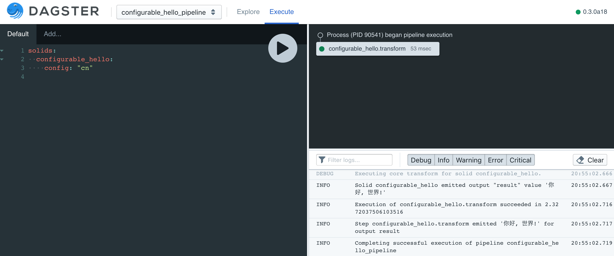

Configuration
-------------
For maximum flexibility, testability, and reusability, we want to avoid hardcoding solids'
(or pipelines') dependencies on the external world. We should be able to run the same code in
different environments for test, in development, and in production, and parametrize our solids'
interactions with the different facilities afforded by each of those interactions. Then, we can
declaratively specify features of our environment without having to rewrite our code.

We'll illustrate this by configuring our hello world example to speak a couple of different
languages.

This time, we'll use a more fully-featured API to define our solid -- 
:py:func:`@solid <dagster.solid>` instead of :py:func:`@lambda_solid <dagster.lambda_solid>`.

.. literalinclude:: ../../dagster/tutorials/intro_tutorial/config.py
   :linenos:
   :caption: config.py

We will be exploring the :py:func:`@solid <dagster.solid>` API in much more detail as this tutorial
proceeds. For now, the only salient difference is that the annotated function takes an additional
first parameter, ``info``, which is of type
:py:class:`TransformExecutionInfo <dagster.TransformExecutionInfo>`. The property ``info.config``
is the configuration passed into each individual solid.

That configuration is specified in the second argument to
:py:func:`execute_pipeline <dagster.execute_pipeline>`, which must be a dict. This dict specifies
*all* of the configuration to execute an entire pipeline. It may have many sections, but we're only
using one of them here: per-solid configuration specified under the key ``solids``:

.. literalinclude:: ../../dagster/tutorials/intro_tutorial/config.py
   :lines: 27-29
   :dedent: 4

The ``solids`` dict is keyed by solid name, and each of its values in turn defines a ``config``
key corresponding to the user-defined configuration schema for each particular solid. In this case,
that's a single scalar string value.

Run this from the command line utility. In order to do this you must provide
a yaml config file:

.. literalinclude:: ../../dagster/tutorials/intro_tutorial/config_env.yml
   :linenos:
   :caption: config_env.yml

Now you can run this pipeline with this config file like so:

.. code-block:: console

   $ dagster pipeline execute -f config.py \
   -n define_configurable_hello_pipeline -e config_env.yml

To run this example from dagit, use the following command:

.. code-block:: console

   $ dagit -f config.py -n define_configurable_hello_pipeline

Just as with configurable inputs, you can edit the configuration on the fly in dagit's built-in
config editor. Try switching languages and rerunning the pipeline!

Next, we'll learn about another part of the ``info`` parameter, the
:doc:`Execution Context <part_five>`.
