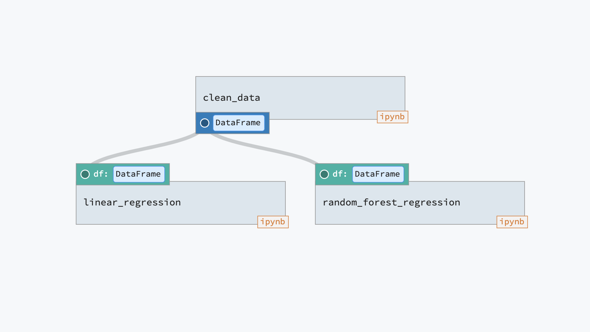
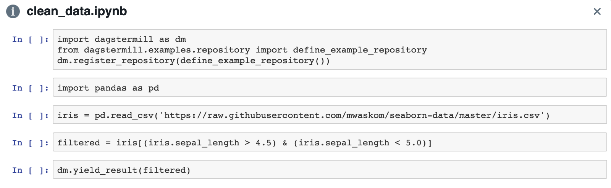

============
Dagstermill 
============

A wonderful feature of using Dagster is that you can productionize Jupyter notebooks and involve them in a (production) pipeline as units of computation. 

There are a few stages of data scientists using notebooks in the wild. 

1. Unstructured scratch work, cells are often run out of order.
2. More refined prototyping, where cells are run sequentially. Usually the top cells contain parameters that are used in later cells. 
3. Pieces of re-usable code are extracted from a notebook, turned into functions and put in a script (``.py`` file)

Typically, only stage 3 would be involved in a production pipeline. However, with dagstermill, if you have a notebook in stage 2 (i.e. cells run sequentially to produce the desired output), with minimal effort you can register this notebook as a solid in the pipeline and use the notebook driven solid as a unit of computation that takes in inputs and produces outputs (that can be consumed by later stages of the pipeline).

------------------------------------------
A (Very Simple) Pipeline with a Notebook
------------------------------------------

Say you have a pipeline as shown below:

.. image:: test_add_pipeline.png

This is a very simple pipeline, where the solid ``return_one`` returns 1 and ``return_two`` returns 2. The notebook driven solid ``add_two_numbers`` simply adds two numbers and returns the result, as the name suggests.

The notebook might have a cell that looks like the following:

.. code-block:: python

    a = 3
    b = 5
    result = 3 + 5

Currently your notebook simply adds together the numbers ``3`` and ``5``, but in a more generic sense, your notebook is effectively a function that takes in inputs ``a`` and ``b`` and products output ``result``. To use the language of the dagster abstraction, it is a solid with inputs ``a``, ``b`` of dagster-type ``Int`` and with an ouput ``result`` of type ``Int``. 

To register this notebook as a dagster solid, we use the following lines of code.

.. code-block:: python

    from dagster import InputDefinition, OutputDefinition, Int
    import dagstermill as dm

    my_notebook_solid = dm.define_dagstermill_solid(
                                name='add_two_numbers',
                                notebook_path='/notebook/path/add_two_numbers.ipynb',
                                inputs = [
                                    InputDefinition(name='a', dagster_type=Int),
                                    InputDefinition(name='b', dagster_type=Int)
                                ],
                                ouputs = [OutputDefinition(Int)]
                            )

The function ``dm.define_dagstermill_solid()`` returns an object of type ``SolidDefinition`` that can be passed into ``PipelineDefinition`` objects. We see that its arguments are rather self-explanatory: 

* ``name``: the name of the solid 
* ``notebook_path``: the location of the notebook so that the dagster execution engine can run the code in the notebook
* ``inputs``, ``outputs``: the named and typed inputs and outputs of the notebook as a solid

However, we also have to add some boilerplate to the notebook itself to make sure it plays nice with the dagstermill framework. The final notebook with the boilerplate looks as follows.

.. image:: add_two_numbers.png

1. ``import dagstermill as dm`` imports the dagstermill library, which is necesary for the rest of the boilerplate
2. ``dm.register_repository()`` takes a repository definition (``define_example_repository()`` in this case) and lets the notebook know how to find the repository that contains the corresponding notebook-driven solid.
3. There is a tagged cell with the tag ``parameters`` that should contain **only** the inputs of the notebook-driven solid.
4.  If the notebook-driven solid has an output, then call ``dm.yield_result()`` with the result.

There is a helpful `Dagstermill CLI`_ that you can use to generate notebooks that will automatically contain the requisite boilerplate.

----------------------------------------
Output Notebooks & How Dagstermill Works
----------------------------------------

The way dagstermill works is by auto-injecting a cell that replaces the `parameters`-tagged cell with the 
runtime values of the inputs and then running the notebook using the `papermill <https://github.com/nteract/papermill/>`_ library. 
A nice side effect of using the papermill library to run the notebook is that the output is contained in an "output notebook", 
and the source notebook remains unchanged. Since the output notebook is itself a valid Jupyter notebook, debugging can be done within the notebook environment! 

The execution log contains the path to the output notebook so that you can access it after execution to examine and potentially debug the output. Within dagit we also provide a link to the output notebook, as shown below.

.. image:: output_notebook.png

----------------------------
Summary of Using Dagstermill 
----------------------------

Initially, you might want to prototype with a notebook without worrying about incorporating it into a dagster pipeline. When you want to incorporate it into a pipeline, do the following steps:

1. Use ``dm.define_dagstermill_solid()`` to define the notebook-driven solid to include within a pipeline
2. Within the notebook, call ``import dagstermill as dm`` and make sure that you register the containing repository with ``dm.register_repository()``
3. Make sure all inputs to the notebook-driven solid are contained in a tagged-cell with the ``parameters`` tag
4. For all outputs, call ``dm.yield_result()`` with the result and output name

The `Dagstermill CLI`_ should help you with stage 2.

-----------------------------------------
A (More Complicated) Dagstermill Pipeline
-----------------------------------------

The above pipeline was a very simplistic use-case of a dagster pipeline involving notebook-driven solids. 
Below we provide a more complicated example of a pipeline involving notebooks with outputs that are fed in as inputs into further steps in the pipeline. 
This is a particular compelling use-case of incorporating notebook-driven solids into a pipeline, as the user no longer has to manually marshall the inputs and outputs of notebooks manually. 
Instead, the dagster execution engine takes care of this for us! Let us look at the following machine-learning inspired pipeline.

The corresponding dagster code for defining the pipeline is as follows:

.. code-block:: python

    def define_tutorial_pipeline():
        return PipelineDefinition(
            name='ML_pipeline',
            solids=[clean_data_solid, LR_solid, RF_solid],
            dependencies={
                SolidInstance('clean_data'): {},
                SolidInstance('linear_regression'): {'df': DependencyDefinition('clean_data')},
                SolidInstance('random_forest_regression'): {'df': DependencyDefinition('clean_data')},
            },
        )

The ``clean_data_solid`` solid is driven by the following notebook: 

We see that this notebook loads some data, filters it and yields it as a dataframe. 
Then, this dataframe is consumed by the solids ``linear_regression`` and ``random_forest_regression``, which both consume inputs ``df`` that is flowed from the output of ``clean_data_solid``.

The ``random_forest_regression`` solid is driven by the following notebook:

.. image:: RF_ipynb.png

Without the dagstermill abstraction, we'd have to manually save the output of the ``clean_data`` notebook to a location and make sure to load the same location in the 2 other notebooks.
However, the dagster execution engine takes care of this marshalling for us, 
so notice that the ``random_forest_regression`` notebook is simply using ``df`` as a parameter 
that will be over-written with its correct runtime value from the result of ``clean_data``.

After running the pipeline, we can examine the ``random_forest_regression`` output notebook, which looks as follows:

.. image:: RF_output_notebook.png

The output notebook is quite convenient, because we can debug within the notebook environment as well as view plots and other output within the notebook context. 
We can also look at the input that was flowed into the notebook (i.e. the filtered output of ``clean_data``).

---------------------
Full Dagstermill API
---------------------

The boilerplate necesary for a notebook involves some of the ``dagstermill`` API, but here we describe some more advanced API functionality.

.. code-block:: python

    notebook_driven_solid = dm.define_dagstermill_solid(
        name, 
        notebook_path, 
        inputs=None, 
        outputs=None, 
        config_field=None
    )

    assert(isinstance(notebook_driven_solid, SolidDefinition))

This function creates a notebook-driven solid by taking in a solid name, notebook location and typed inputs and outputs, and returns a SolidDefinition that can be used in a dagster Pipeline.

**Parameters**: 

* **name** (str) -- Name of solid in pipeline
* **notebook_path** (str) -- File path of notebook that drives the solid
* **inputs** (list[InputDefinition]) 
* **outputs** (list[OutputDefinition])
* **config_field** (generic) -- Config for the solid

.. code-block:: python 
    
    dm.register_repository(repository_defn)

To use a notebook as a solid in a pipeline, the first cell of the notebook *must* register the repository to which the notebook driven solid belongs.

**Parameters**

* **repository_defn** (RepositoryDefinition) -- RepositoryDefinition object to which solid belongs

.. code-block:: python

    dm.yield_result(result_obj, output_name="result")

If the notebook driven solid has outputs (as defined when using ``define_dagstermill_solid``), then call ``yield_result`` with the output and the output name (defaults to ``result``) to produce output for consumption for solids in later stages of the pipeline.

**Parameters**

* result_obj (generic) -- The result of the computation, must be of the type specified in the corresponding ``OutputDefinition``
* output_name (str) -- Defaults to "result", but must match the name given in the OutputDefinition (which defaults to ``"result"`` if there is only 1 output)

.. code-block:: python
    
    context = dm.get_context(config=None)
    assert (isinstance(context, AbstractTransformExecutionContext))
    context.log.info("This will log some info to the logger")

If you want access to the context object that is available in other solids, then you can call ``get_context()`` with the desired config within the notebook to access the context object and manipulate it as you would in any other solid. When the notebook is run as a solid in a pipeline, the context will be injected at runtime with the configuration provided for the entire pipeline. 

**Parameters**

* config (dict) -- The config for the context (think dict version of yaml typically passed into config)

===============
Dagstermill CLI
===============

To assist you in productionizing notebooks, the dagstermill CLI will be helpful in adding boilerplate to existing notebooks to turn them into dagster solids (or creating notebooks from scratch with the requisite boilerplate).

To create a notebook when you know the repository, use the ``dagstermill create-notebook`` command. The notebook name is provided with the ``--notebook`` argument. A repository can be provided using the ``.yml`` file or the other command line options for specifying the location of a repository definition. If the repository is not provided, then the scaffolding ``dm.register_repository()`` is not inserted.

.. code-block:: console
    
    $ dagstermill create-notebook --notebook "notebook_name" -y repository.yml

Normally, the ``create-notebook`` command will prompt to ask if you want to over-write an existing notebook with the same name (if such a notebook exists). The ``--force-overwrite`` flag forces the over-write.

.. code-block:: console 

    $ dagstermill create-notebook --help

    Usage: dagstermill create-notebook [OPTIONS]

    Creates new dagstermill notebook.

    Options:
    -n, --fn-name TEXT          Function that returns either repository or
                                pipeline
    -m, --module-name TEXT      Specify module where repository or pipeline
                                function lives
    -f, --python-file TEXT      Specify python file where repository or pipeline
                                function lives.
    -y, --repository-yaml TEXT  Path to config file. Defaults to
                                ./repository.yml. if --python-file and --module-
                                name are not specified
    -note, --notebook TEXT      Name of notebook
    --force-overwrite           Will force overwrite any existing notebook or
                                file with the same name.
    --help                      Show this message and exit.

**TODO**: Currently we don't auto-inject the parameters cell if it doesn't exist, but we can change the CLI to do this.

Given a notebook that does not have the requisite scaffolding (perhaps a notebook created before knowing exact what dagster repository it belongs in), use the ``register-notebook`` command to specify an existing notebook and repository, and the CLI will inject the requiste cells in the notebook with the boilerplate for registering the repository and adding the parameters-tagged cell, if one doesn't exist. Note that this CLI command operates **in-place**, so the original notebook is modified!

.. code-block:: console

    $ dagstermill register-notebook --notebook path/to/notebook -y repository.yaml

**Example CLI usage** 

.. code-block:: console

    $ dagstermill create-notebook --notebook test_notebook

Gives the following notebook--notice how there is no call to ``register_repository`` within the notebook. 

.. image:: pre_boilerplate_notebook.png

After a while, say you finally have a repository file (``repository.yml``). Then you register the notebook, giving the following: 

.. code-block:: console

    $ ls
    test_notebook.ipynb repository.yml
    $ dagstermill register-notebook --notebook test_notebook.ipynb -y repository.yml

.. image:: post_boilerplate_notebook.png

