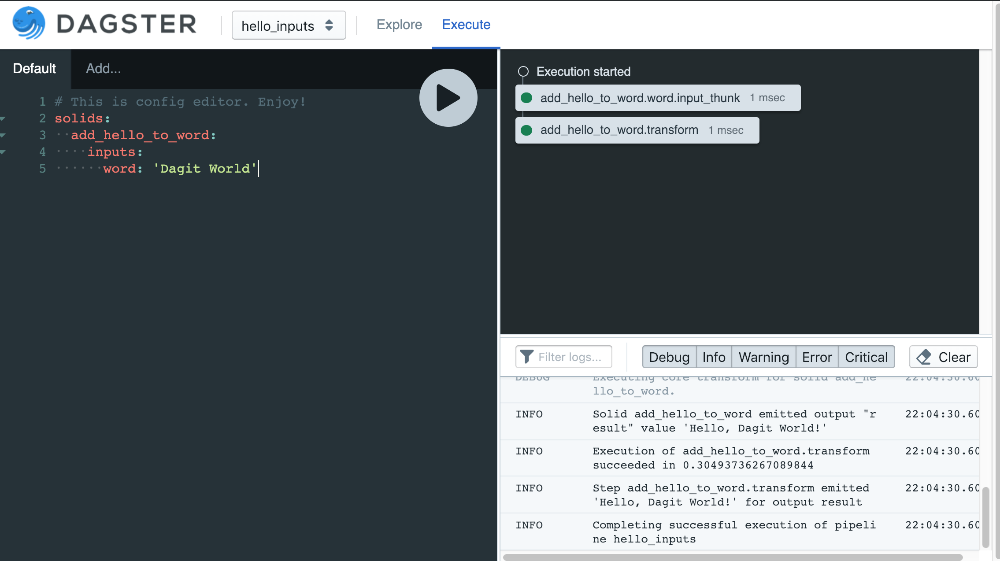
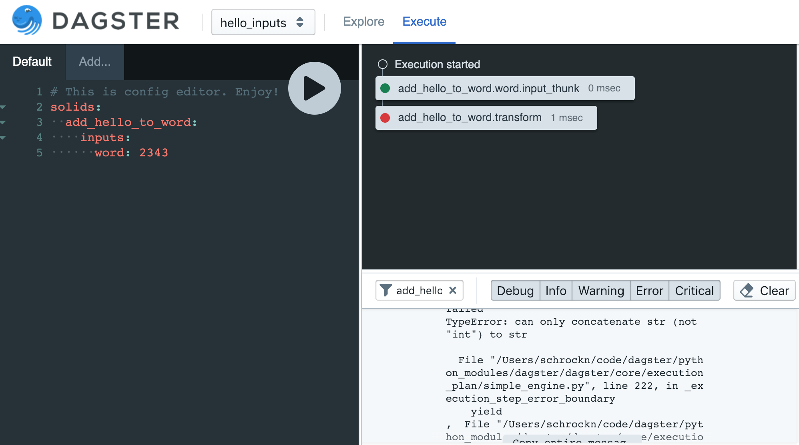
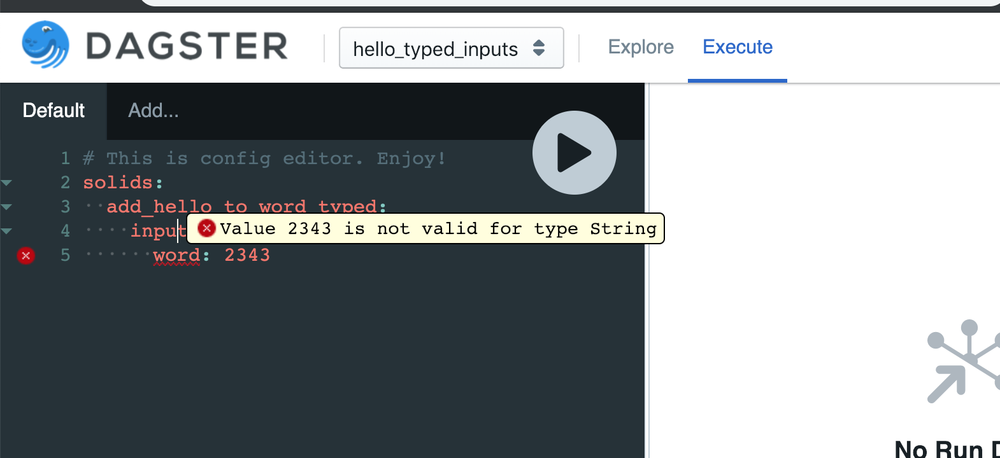

Inputs
------
So far we have only demonstrated pipelines whose solids yield hardcoded values and then flow them
through the pipeline. In order to be useful a pipeline must also interact with its external
environment.

Let's return to our hello world example. But this time, we'll make the string
the solid returns be parameterized based on inputs.

.. literalinclude:: ../../dagster/tutorials/intro_tutorial/inputs.py
   :lines: 1-17
   :linenos:
   :caption: inputs.py

Note that the input ``word`` to solid ``add_hello_to_word`` has no dependency specified. This
means that the operator of the pipeline must specify the input at pipeline execution
time.

Recall that there are three primary ways to execute a pipeline: using the python API, from 
the command line, and from dagit. We'll go through each of these and see how to specify the input
in each case.

Python API
~~~~~~~~~~
In the Python API, pipeline configuration is specified in the second argument to
:py:func:`execute_pipeline <dagster.execute_pipeline>`, which must be a dict. This dict contains
*all* of the configuration to execute an entire pipeline. It may have many sections, but we'll only
use one of them here: per-solid configuration specified under the key ``solids``:

.. literalinclude:: ../../dagster/tutorials/intro_tutorial/inputs.py
    :linenos:
    :lines: 25,27,29-31
    :dedent: 8 

The ``solids`` dict is keyed by solid name, and each solid is configured by a dict that may have
several sections of its own. In this case we are only interested in the ``inputs`` section, so
that we can specify that value of the input ``word``.

The function ``execute_with_another_world`` demonstrates how one would invoke this pipeline
using the python API:

.. literalinclude:: ../../dagster/tutorials/intro_tutorial/inputs.py
    :linenos:
    :lines: 20-22,25,27,29-32

CLI
~~~

Next let's use the CLI. In order to do that we'll need to provide the environment
information via a config file. We'll use the same values as before, but in the form
of YAML rather than python dictionaries:

.. literalinclude:: ../../dagster/tutorials/intro_tutorial/inputs_env.yml
   :language: YAML
   :linenos:
   :caption: inputs_env.yml

And now specify that config file via the ``-e`` flag.

.. code-block:: console

    $ dagster pipeline execute -f inputs.py \
    -n define_hello_inputs_pipeline -e inputs_env.yml 

Dagit
~~~~~

As always, you can load the pipeline and execute it within dagit.

.. code-block:: console

   $ dagit -f inputs.py -n define_hello_inputs_pipeline
   Serving on http://127.0.0.1:3000

From the execute console, you can enter your config directly like so:

You'll notice that the config editor is auto-completing. Because it knows the structure
of the config, the editor can provide rich error information. We can improve the experience of
using the editor by appropriately typing the inputs, making everything less error-prone.

Typing
^^^^^^

Right now the inputs and outputs of this solid are totally untyped. (Any input or output
without a type is automatically assigned the ``Any`` type.) This means that mistakes
are often not surfaced until the pipeline is executed.

For example, imagine if our environment for our pipeline was:

.. literalinclude:: ../../dagster/tutorials/intro_tutorial/inputs_env_bad.yml
   :language: YAML
   :linenos:
   :caption: inputs_env_bad.yml

If we execute this pipeline with this config, it'll fail at runtime.

Enter this config in dagit and execute and you'll see the transform fail:

Click on the red dot on the execution step that failed and a detailed stacktrace will pop up.

.. image:: inputs_figure_three_error_modal.png

It would be better if we could catch this error earlier, when we specify the config. So let's
make the inputs typed.

A user can apply types to inputs and outputs. In this case we just want to type them as the
built-in ``String``.

.. literalinclude:: ../../dagster/tutorials/intro_tutorial/inputs.py
   :lines: 35-40
   :emphasize-lines: 2-3
   :caption: inputs.py

By using typed input instead we can catch this error prior to execution.

Next, we'll look at a closely allied concept -- :doc:`Configuration <config>` values.
