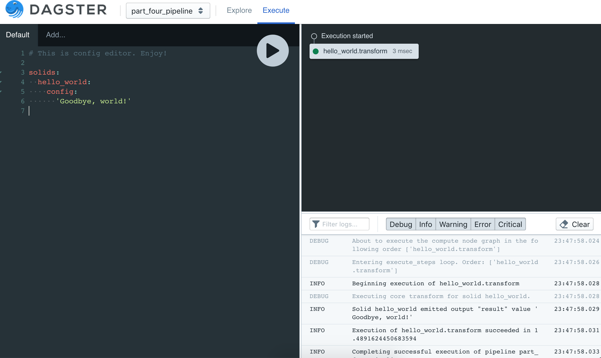

Configuration
-------------
So far we have only demonstrated pipelines whose solids yield hardcoded values and then flow them
through the pipeline. In order to be useful a pipeline must also interact with its external
environment.

For maximum flexibility, testability, and reusability, we want to avoid hardcoding solids'
(or pipelines') dependencies on the external world. Configuration is the mechanism dagster
provides to make that possible.

Let's return to our hello world example. But this time, we'll parametrize the string that the
solid yields through config.

This time, we'll use a more fully-featured API to define our solid -- 
:py:func:`@solid <dagster.solid>` instead of :py:func:`@lambda_solid <dagster.lambda_solid>`.

.. literalinclude:: ../../dagster/tutorials/intro_tutorial/part_four.py
   :linenos:
   :caption: part_four.py

We will be exploring the :py:func:`@solid <dagster.solid>` API in much more detail as this tutorial
proceeds. For now, the only salient difference is that the annotated function takes an additional
first parameter, ``info``, which is of type
:py:class:`TransformExecutionInfo <dagster.TransformExecutionInfo>`. The property ``info.config``
is then the configuration passed into each individual solid.

That configuration is specified in the second argument to
:py:func:`execute_pipeline <dagster.execute_pipeline>`, which must be a dict. This dict specifies
*all* of the configuration to execute an entire pipeline. It may have many sections, but we're only
using one of them here: per-solid configuration specified under the key ``solids``:

.. literalinclude:: ../../dagster/tutorials/intro_tutorial/part_four.py
   :lines: 23-27
   :dedent: 12

The ``solids`` dict is keyed by solid name, and each of its values in turn defines a ``config``
key corresponding to the user-defined configuration schema for each particular solid. In this case,
that's a single scalar string value.

Run this from the command line utility. In order to do this you must provide
a yaml config file:

.. literalinclude:: ../../dagster/tutorials/intro_tutorial/part_four_env.yml
   :linenos:
   :caption: part_four_env.yml

Now you can run this pipeline with this config file like so:

.. code-block:: sh

    $ dagster pipeline execute -f part_four.py \
    -n define_configurable_hello_world_pipeline -e part_four_env.yml

To run this example from dagit, use the following command:

.. code-block:: sh
    $ dagit -f part_four.py -n define_configurable_hello_world_pipeline

 you can also edit the configuration on the fly in the built-in
config editor. This editor includes a handy type-ahead and useful tooltips when you've entered an
invalid config. Play around with it!

Next, we'll learn about another part of the ``info`` parameter, the
:doc:`Execution Context <part_four>`.
