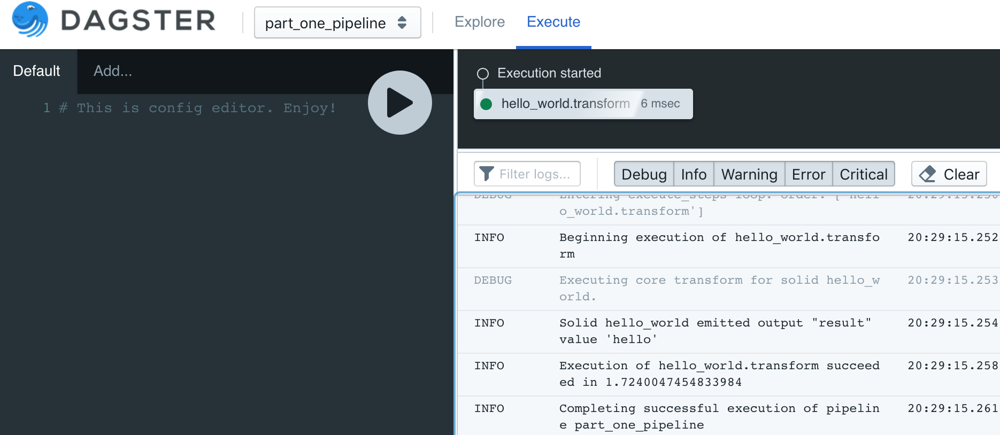

Hello, World
------------
See :doc:`../installation` for instructions getting dagster -- the core library -- and dagit --  
the web UI tool used to visualize your data pipelines -- installed on your platform of choice.

Let's write our first pipeline and save it as ``part_one.py``.

.. literalinclude:: ../../tutorials/intro_tutorial/part_one.py
   :linenos:
   :lines: 1-2, 4-17
   :caption: part_one.py

This example introduces three concepts:

1) A **solid** is a functional unit of computation in a data pipeline. In this example, we use the
decorator ``@lambda_solid`` to mark the function ``hello_world`` as a solid: a functional unit
which takes no inputs and returns the output ``'hello'`` every time it's run.

2) A **pipeline** is a set of solids arranged into a DAG of computation that produces data assets.
In this example, the call to ``PipelineDefinition`` defines a pipeline with a single solid.

3) We **execute** the pipeline by running ``execute_pipeline``. Dagster will call into each solid
in the pipeline, functionally transforming its inputs, if any, and threading its outputs to solids
further on in thre DAG.

Assuming you've saved this pipeline as ``part_one.py``, we can execute it using the dagster CLI:

.. code-block:: console

    $ dagster pipeline execute -f part_one.py -n define_hello_world_pipeline
    2018-12-17 12:16:51 - dagster - INFO - orig_message="Beginning execution of pipeline part_one_pipeline" log_message_id="2c247b57-7701-44fc-bef8-72e39907b348" run_id="2ba4192f-9be6-4dcf-81c7-01b4e9dfe32b" pipeline="part_one_pipeline" event_type="PIPELINE_START"
    2018-12-17 12:16:51 - dagster - INFO - orig_message="Beginning execution of hello_world.transform" log_message_id="8f163495-14cf-4ece-a312-bfc6be8771f9" run_id="2ba4192f-9be6-4dcf-81c7-01b4e9dfe32b" pipeline="part_one_pipeline" solid="hello_world" solid_definition="hello_world" event_type="EXECUTION_PLAN_STEP_START" step_key="hello_world.transform"
    2018-12-17 12:16:51 - dagster - INFO - orig_message="Solid hello_world emitted output \"result\" value 'hello'" log_message_id="d748771a-046f-407d-8775-1b1e20c833d7" run_id="2ba4192f-9be6-4dcf-81c7-01b4e9dfe32b" pipeline="part_one_pipeline" solid="hello_world" solid_definition="hello_world"
    2018-12-17 12:16:51 - dagster - INFO - orig_message="Execution of hello_world.transform succeeded in 8.906841278076172" log_message_id="6a4116ce-6683-4456-b744-659298653e63" run_id="2ba4192f-9be6-4dcf-81c7-01b4e9dfe32b" pipeline="part_one_pipeline" solid="hello_world" solid_definition="hello_world" event_type="EXECUTION_PLAN_STEP_SUCCESS" millis=8.906841278076172 step_key="hello_world.transform"
    2018-12-17 12:16:51 - dagster - INFO - orig_message="Completing successful execution of pipeline part_one_pipeline" log_message_id="3e6b9f81-a0d4-4909-9881-6fcb7dea2627" run_id="2ba4192f-9be6-4dcf-81c7-01b4e9dfe32b" pipeline="part_one_pipeline" event_type="PIPELINE_SUCCESS"

There's a lot of information in these log lines (we'll get to how you can use, and customize,
them later), but you can see that the third message is:
```Solid hello_world emitted output \"result\" value 'hello'"```. Success!

To visualize your pipeline (which only has one node) in dagit, you can run:

.. code-block:: console

   $ dagit -f part_one.py -n define_hello_world_pipeline
   Serving on http://127.0.0.1:3000

You should be able to navigate to http://127.0.0.1:3000/part_one_pipeline/explore in your web
browser and view your pipeline.

.. image:: part_one_fig_one.png

There are lots of ways to execute dagster pipelines. If you navigate to the "Execute"
tab (http://127.0.0.1:3000/part_one_pipeline/execute), you can execute your pipeline directly from
dagit. Logs will stream into the bottom right pane of the interface, where you can filter them by
log level.



If you'd rather execute your pipelines as a script, you can do that without using the dagster CLI
at all. Just add a few lines to `part_one.py` (highlighted in yellow):

.. literalinclude:: ../../tutorials/intro_tutorial/part_one.py
   :linenos:
   :caption: part_one.py
   :emphasize-lines: 3,19-21

Then you can just run:

.. code-block:: console

    $ python part_one.py

Next, let's build our first multi-solid DAG in :doc:`Hello, DAG <part_two>`!
