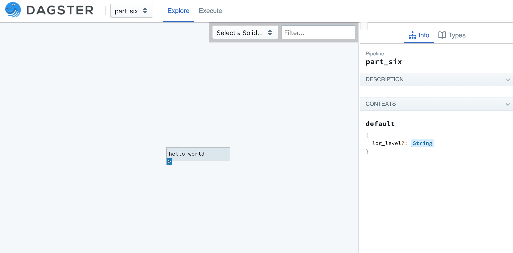

Repositories
------------
Dagster is a not just a programming model for pipelines, it is also a platform for
tool-building. You've already met the dagster and dagit CLI tools, which let you programmatically
run and visualize pipelines.

In previous examples we have specified a file (``-f``) and named a pipeline definition function
(``-n``) in order to tell the CLI tools how to load a pipeline:

.. code-block:: console

   $ dagit -f part_one.py -n define_hello_world_pipeline
   $ dagster pipeline execute -f part_one.py -n define_hello_world_pipeline

But most of the time, especially when working on long-running projects with other people, we will
want to be able to target many pipelines at once with our tools. 

A **repository** is a collection of pipelines to which dagster tools may be pointed.

Repostories are declared using a new API,
:py:func:`RepositoryDefinition <dagster.RepositoryDefinition>`:

.. literalinclude:: ../../dagster/tutorials/intro_tutorial/part_six.py
   :linenos:
   :caption: part_six.py

If you save this file as ``part_six.py``, you can then run the command line tools on it. Try running:

.. code-block:: console

    $ dagster pipeline list -f part_six.py -n define_part_six_repo
    Repository part_six_repo
    ************************
    Pipeline: part_six
    Solids: (Execution Order)
        hello_world

Typing the name of the file and function defining the repository gets tiresome and repetitive, so
let's create a declarative config file with this information to make using the command line tools
easier. Save this file as "repository.yml". This is the default name for a repository config file,
although you can tell the CLI tools to use any file you like.

.. literalinclude:: ../../dagster/tutorials/intro_tutorial/part_six_repository_1.yml
   :linenos:
   :caption: repository.yml

Now you should be able to list the pipelines in this repo without all the typing:

.. code-block:: console

    $ dagster pipeline list
    Repository part_six_repo
    ************************
    Pipeline: part_six
    Solids: (Execution Order)
        hello_world

You can also specify a module instead of a file in the repository.yml file.

.. literalinclude:: ../../dagster/tutorials/intro_tutorial/part_six_repository_2.yml
   :linenos:
   :caption: repository.yml

Dagit
^^^^^
We've already seen dagit in action when we visualized our pipelines earlier. Dagit uses the same
pattern as the other dagster CLI tools. If you've defined a repository.yml file, just run it with
no arguments, and you can visualize and execute all the pipelines in your repository:

.. code-block:: console

    $ dagit
    Serving on http://localhost:3000

In part seven of the tutorial, we'll get to know :doc:`Pipeline Execution <part_seven>`. a little
better, and learn how to execute pipelines from the command line, with swappable config.
