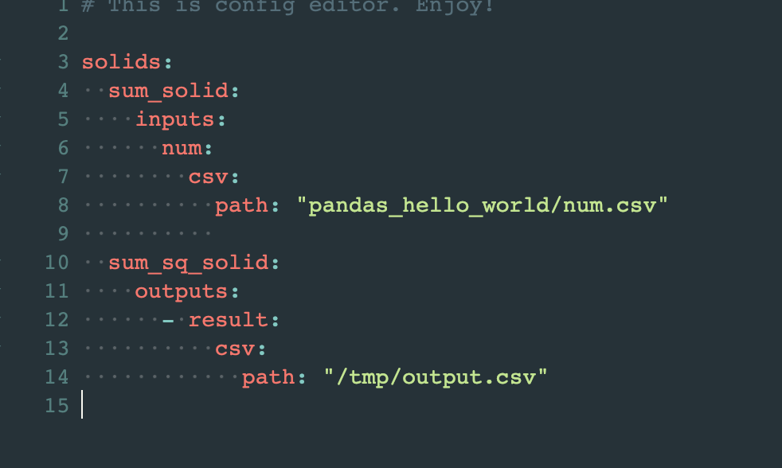
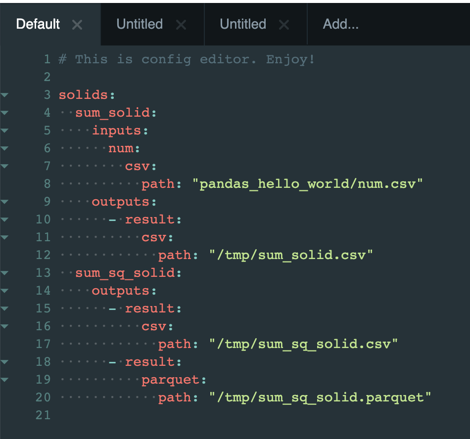

User-Defined Types
------------------

Throughout the the tutorial you have seen the use of builtins such as :py:class:`Int <dagster.Int>`
and :py:class:`String <dagster.String>` for types. However you will want to be able to define your
own dagster types to fully utilize the system. We'll go over that here.

As a pedogogical example, we will go over the code used to the define the ``PandasDataFrame`` type
in the dagster-pandas library, building it step by step along the way.

Basic Typing
^^^^^^^^^^^^

.. code-block:: py

    import pandas as pd
    from dagster import as_dagster_type

    DataFrame = as_dagster_type(
        pd.DataFrame,
        name='PandasDataFrame',
        description='''Two-dimensional size-mutable, potentially
        heterogeneous tabular data structure with labeled axes 
        (rows and columns). See http://pandas.pydata.org/'''
    )

What this code doing is annotating/registering an existing type as a dagster type. Now one can include
this type and use it as an input or output of a solid. The system will do a typecheck to ensure
that the object is of type `pd.DataFrame`.

Now one can use it to define a solid:

.. code-block:: py

    @lambda_solid(
        inputs=[InputDefinition('num', DataFrame)],
        output=OutputDefinition(DataFrame),
    )
    def sum_solid(num):
        sum_df = num.copy()
        sum_df['sum'] = sum_df['num1'] + sum_df['num2']
        return sum_df

The type metadata now appears in dagit and the system will ensure the input and output to this
solid are indeed data frames.

Input Schema
^^^^^^^^^^^^

This solid as defined is only expressed in terms of an in-memory object; it says nothing about
how this data should be sourced from or materialized to disk. This is where the notion of
input and output schemas come into play. Once the user provides those she is able to use
the configuration language in order to parameterize the computation.

Let us now add the input schema:

.. code-block:: py

    def define_path_dict_field():
        return Field(Dict({'path': Field(Path)}))

    def define_csv_dict_field():
        return Field(
            Dict(
                {
                    'path': Field(Path), 
                    'sep': Field(
                        String,
                        is_optional=True,
                        default_value=','
                    )
                }
            )
        )

    @input_schema(
        Selector(
            {
                'csv': define_csv_dict_field(),
                'parquet': define_path_dict_field(),
                'table': define_path_dict_field(),
            }
        )
    )
    def dataframe_input_schema(config_value):
        # Because the config type passed into the input_schema
        # above is a Selector, config_value is guaranteed to be
        # a dictionary with a single element
        file_type, file_options = list(config_value.items())[0]

        if file_type == 'csv':
            path = file_options['path']
            del file_options['path']
            return pd.read_csv(path, **file_options)
        elif file_type == 'parquet':
            return pd.read_parquet(file_options['path'])
        elif file_type == 'table':
            return pd.read_table(file_options['path'])
        else:
            raise DagsterInvariantViolationError(
                'Unsupported file_type {file_type}'.format(
                    file_type=file_type
                )
            )

Any input schema is define by a decorated function with a single argument. The argument is the
format the input schema takes. In this case it is a `Selector`. Selectors are used when you want
to be able present several different options to the user but force them to select one. In this case,
for example, it would not make much sense to allow them to say that a single input should be sourced
from a csv and a parquet file: They must choose. (In other type systems this might be called an "input
union.")

Note our selector provides three keys: `csv`, `parquet`, and `table`. Each of these in turn has
their own subfield selections. You'll note that these are `Dict` requiring the user to provide all
required fields, rather than only one.

The remaining step here is that the user must provide code that takes those validated configurated
files and produces an object of the expected type. In this case that would be the pandas DataFrame
type. The user can assume the value abides by the provided schema and that any and all default
values have been applied.

Selectors are very commonly used for these type of schemas, so we've also provided an alternative
API that removes some boilerplate around manipulating the config_value dictionary. Instead, the
user-provided function takes the unpacked key and value of config_value directly, since in the
case of a selector, the config_value dictionary has only 1 (key, value) pair.

.. code-block:: py

    @input_selector_schema(
        Selector(
            {
                'csv': define_csv_dict_field(),
                'parquet': define_path_dict_field(),
                'table': define_path_dict_field(),
            }
        )
    )
    def dataframe_input_schema(file_type, file_options):
        if file_type == 'csv':
            path = file_options['path']
            del file_options['path']
            return pd.read_csv(path, **file_options)
        elif file_type == 'parquet':
            return pd.read_parquet(file_options['path'])
        elif file_type == 'table':
            return pd.read_table(file_options['path'])
        else:
            raise DagsterInvariantViolationError('
                'Unsupported file_type {file_type}'.format(
                    file_type=file_type
                )
            )

You'll note that we no longer need to manipulate the config_value dictionary. It grabs
that key and value for you and calls the provided function.

Finally insert this into the original declaration:

.. code-block:: py

    DataFrame = as_dagster_type(
        pd.DataFrame,
        name='PandasDataFrame',
        description='''Two-dimensional size-mutable, potentially
    heterogeneous tabular data structure with labeled axes 
    (rows and columns). See http://pandas.pydata.org/'''
        input_schema=dataframe_input_schema,
    )

Now if you run a pipeline with this solid from dagit you will be able to provide sources for
these inputs via config:

.. image:: types_figure_one.png

Output Schema
^^^^^^^^^^^^^

We will add output schema now. They are similar to input schema, except that they are responsible
for taking the in-memory object flowed through your computation and materializing it to some
persistent store. Outputs are purely *optional* for any computation, whereas inputs *must* be provided
for a computation to proceed. You will likely want outputs as for a pipeline to be useful it
should produce some materialization that outlives the computation.

.. code-block:: py

    @output_selector_schema(
        Selector(
            {
                'csv': define_csv_dict_field(),
                'parquet': define_path_dict_field(),
                'table': define_path_dict_field(),
            }
        )
    )
    def dataframe_output_schema(file_type, file_options, pandas_df):
        check.str_param(file_type, 'file_type')
        check.dict_param(file_options, 'file_options')
        check.inst_param(pandas_df, 'pandas_df', DataFrame)

        if file_type == 'csv':
            path = file_options['path']
            del file_options['path']
            return pandas_df.to_csv(path, index=False, **file_options)
        elif file_type == 'parquet':
            return pandas_df.to_parquet(file_options['path'])
        elif file_type == 'table':
            return pandas_df.to_csv(file_options['path'], sep='\t', index=False)
        else:
            check.failed('Unsupported file_type {file_type}'.format(file_type=file_type))

This has a similar aesthetic to an input schema but performs a different function. Notice that
it takes a third argument, `pandas_df` (it can be named anything), that is the value that was
outputted from the solid in question. It then takes the configuration data as "instructions" as to
how to materialize the value.

One connects the output schema to the type as follows:

.. code-block:: py

    DataFrame = as_dagster_type(
        pd.DataFrame,
        name='PandasDataFrame',
        description='''Two-dimensional size-mutable, potentially
    heterogeneous tabular data structure with labeled axes 
    (rows and columns). See http://pandas.pydata.org/'''
        input_schema=dataframe_input_schema,
        output_schema=dataframe_output_schema,
    )
 
Now we can provide a list of materializations to a given execution.

You'll note you can provide an arbitrary number of materializations. You can materialize any
given output any number of times in any number of formats.

