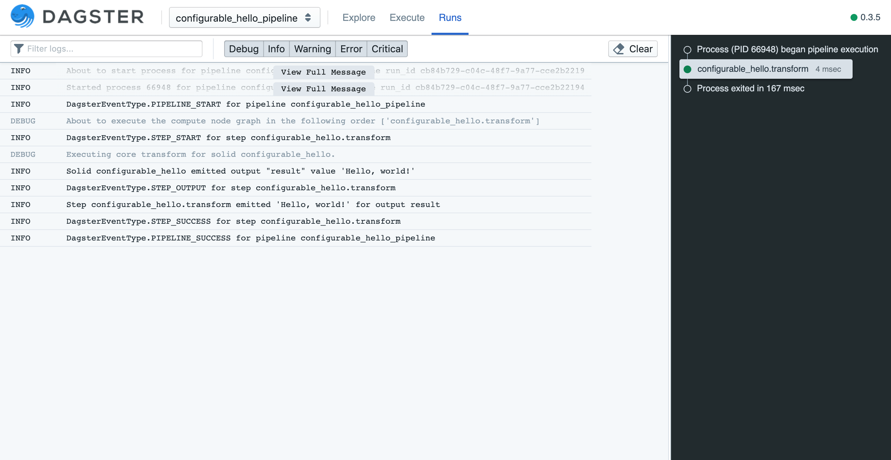

Configuration
-------------
For maximum flexibility, testability, and reusability, we want to avoid hardcoding solids'
(or pipelines') dependencies on the external world.

We should be able to run the same code in different environments for test, in development, and in
production, and to parametrize our solids' interactions with the different facilities afforded by
each of those environments.

Then, we can declaratively specify features of our environment without having to rewrite our code.

Conceptually, where **inputs** are inputs to the computation done by a single solid, and might be
linked by a dependency definition to **outputs** of a previous computation in a DAG,
**configuration** should be used to specify *how* a computation executes.

We'll illustrate this by configuring our hello world example to speak a couple of different
languages.

This time, we'll use a more fully-featured API to define our solid -- 
:py:func:`@solid <dagster.solid>` instead of :py:func:`@lambda_solid <dagster.lambda_solid>`.

.. literalinclude:: ../../../../dagster/tutorials/intro_tutorial/config.py
   :linenos:
   :caption: config.py

We will be exploring the :py:func:`@solid <dagster.solid>` API in much more detail as this tutorial
proceeds. For now, the salient differences are:

1. The :py:func:`@solid <dagster.solid>` API takes an additional parameter, `config_field`, which
   defines the structure and type of configuration values that can be set on each execution of the
   solid. This parameter should be a :py:func:`Field <dagster.Field>`, which tells the dagster
   machinery how to translate config values into runtime values available to the solid.
2. The function annotated by the :py:func:`@solid <dagster.solid>` API receives an additional first
   parameter, ``context``, of type :py:class:`TransformExecutionContext <dagster.TransformExecutionContext>`.
   The configuration passed into each solid is available to the annotated function as ``context.solid_config``.

Configuration values are passed in a dict as the second argument to
:py:func:`execute_pipeline <dagster.execute_pipeline>`. This dict specifies *all* of the
configuration to execute an entire pipeline. It may have many sections, but we're only
using one of them here: per-solid configuration specified under the key ``solids``.

.. literalinclude:: ../../../../dagster/tutorials/intro_tutorial/config.py
   :lines: 28
   :dedent: 8

The ``solids`` dict is keyed by solid name, and each of its values in turn defines a ``config``
key corresponding to the user-defined configuration schema for each particular solid (which we set
before using the ``config_field`` parameter). If these values don't match the user-defined schema,
we'll get a helpful error message.

In this case, we've defined a single scalar string value as config.

Let's see how to run this pipeline, with config, from the command line. In order to do this you 
must provide config in the form of a yaml file:

.. literalinclude:: ../../../../dagster/tutorials/intro_tutorial/config_env.yml
   :linenos:
   :caption: config_env.yml

Now you can run this pipeline with this config file like so:

.. code-block:: console

   $ dagster pipeline execute -f config.py \
   -n define_configurable_hello_pipeline -e config_env.yml

To run this example from dagit, use the following command:

.. code-block:: console

   $ dagit -f config.py -n define_configurable_hello_pipeline

Just as with configurable inputs, you can edit the configuration on the fly in dagit's built-in
config editor. Try switching languages and rerunning the pipeline!

Next, we'll learn about configuration schemas and how the type system can help with the management
of config: :doc:`Configuration Schemas <configuration_schemas>`.
