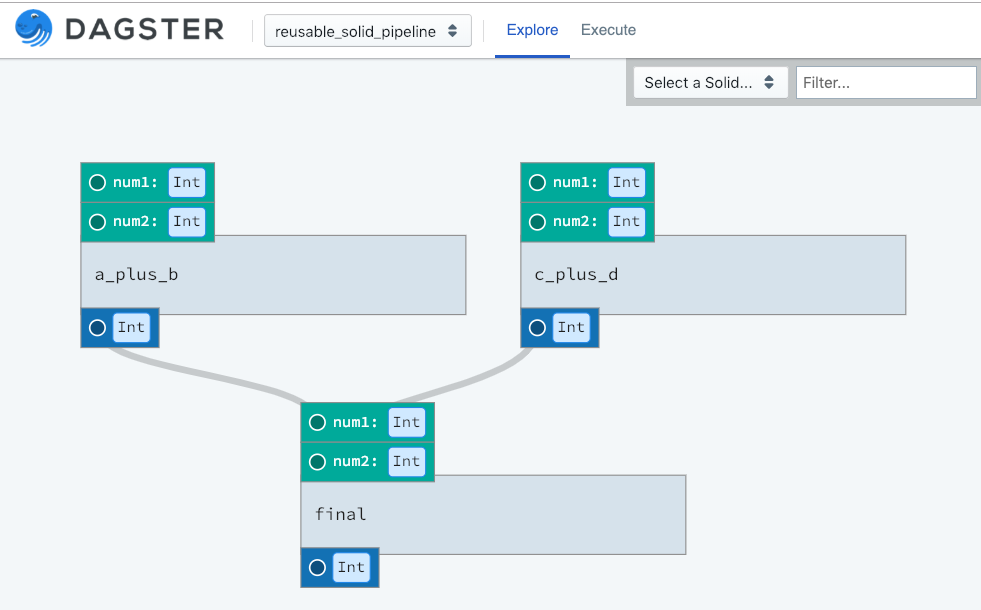

Reusable Solids
---------------

So far we have been using solids tailor-made for each pipeline they were resident in, and have
only used a single instance of that solid. However, solids are, at their core, a specialized type
of function. And like functions, they should be reusable and not tied to a particular call site.

Imagine we have some solids that perform generic mathematical computations and we want them to
be reusable. E.g. we want to have a generic ``adder`` solid and use it a couple times within
a pipeline. Using APIs presented so far, that would be impossible: there would be a name collision
if one included two copies of the solid.

Instead we introduce a new class ``SolidInstance`` that allows the user to create multiple, named instances
of a single solid:

.. literalinclude:: ../../../../dagster/tutorials/intro_tutorial/reusable_solids.py
   :linenos:
   :caption: reusable_solids.py

You'll notice that now have two copies of the adder solid.

You can think of the solids parameter as declaring what solids are "in-scope" for the
purposes of this pipeline, and the dependencies parameter is how they instantiated
and connected together. Within the dependency graph and in config, the alias of the
particular instance is used, rather than the name of the definition.

If you inspect this in dagit, you'll see those two instances:

You also use the aliases in the environment config. In order to execute this pipeline, use
the following config file:

.. literalinclude:: ../../../../dagster/tutorials/intro_tutorial/reusable_solids.yml
   :linenos:
   :caption: reusable_solids.yml

Load this in dagit and you'll see that the node are the graph are labeled with
their instance name.

.. code-block:: sh

        $ dagit -f part_thirteen.py -n define_part_thirteen_step_two 

Now these arithmetic operations are not particularly interesting, but one
can imagine reusable solids doing more useful things like uploading files
to cloud storage, unzipping files, etc.
